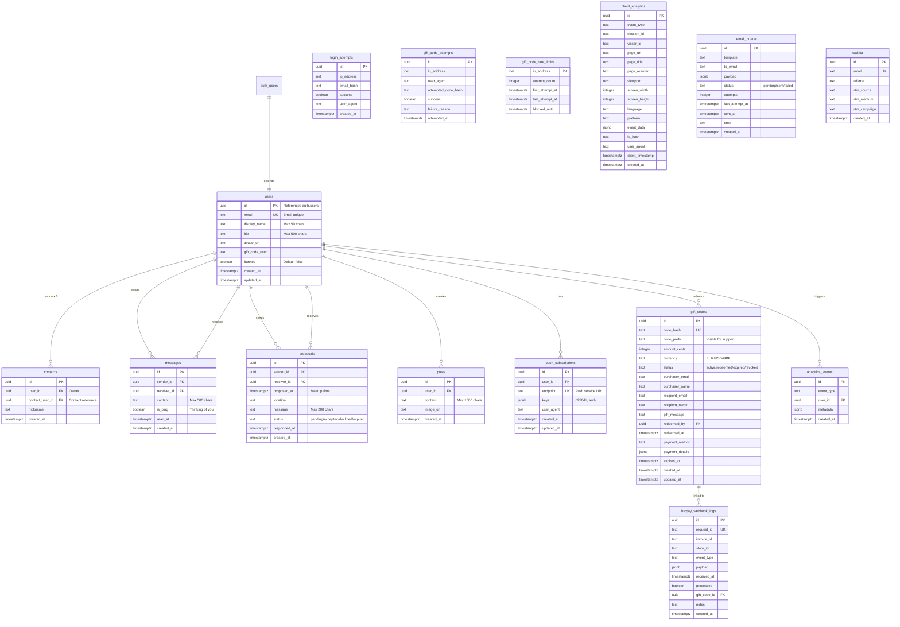

# CINQ Database Schema

> **Database:** Supabase (PostgreSQL)  
> **Last Updated:** 2025-02-01  
> **Tables:** 15 | **Functions:** 12 | **Triggers:** 7

## Table of Contents

- [Entity Relationship Diagram](#entity-relationship-diagram)
- [Core Tables](#core-tables)
  - [users](#users)
  - [contacts](#contacts)
  - [messages](#messages)
  - [proposals](#proposals)
  - [posts](#posts)
- [Authentication & Security](#authentication--security)
  - [login_attempts](#login_attempts)
  - [push_subscriptions](#push_subscriptions)
- [Gift Codes System](#gift-codes-system)
  - [gift_codes](#gift_codes)
  - [gift_code_attempts](#gift_code_attempts)
  - [gift_code_rate_limits](#gift_code_rate_limits)
- [Payments](#payments)
  - [btcpay_webhook_logs](#btcpay_webhook_logs)
- [Analytics](#analytics)
  - [analytics_events](#analytics_events)
  - [client_analytics](#client_analytics)
- [Email & Notifications](#email--notifications)
  - [email_queue](#email_queue)
- [Marketing](#marketing)
  - [waitlist](#waitlist)
- [Functions & Triggers](#functions--triggers)
- [Row Level Security (RLS)](#row-level-security-rls)

---

## Entity Relationship Diagram



---

## Core Tables

### users

Main user profiles that extend Supabase `auth.users`.

| Column | Type | Constraints | Description |
|--------|------|-------------|-------------|
| `id` | `UUID` | PK, FK → auth.users | User ID (matches auth.users.id) |
| `email` | `TEXT` | UNIQUE, NOT NULL | User email (validated format) |
| `display_name` | `TEXT` | Max 50 chars | Display name |
| `bio` | `TEXT` | Max 500 chars | User biography |
| `avatar_url` | `TEXT` | - | Profile picture URL |
| `gift_code_used` | `TEXT` | - | Gift code used at registration |
| `banned` | `BOOLEAN` | Default false | Account ban status |
| `created_at` | `TIMESTAMPTZ` | Default NOW() | Creation timestamp |
| `updated_at` | `TIMESTAMPTZ` | Default NOW() | Last update timestamp |

**Indexes:**
- `idx_users_email` on `email`
- `idx_users_created_at` on `created_at`

**Constraints:**
- Email format validation: `email ~* '^[A-Za-z0-9._%+-]+@[A-Za-z0-9.-]+\.[A-Za-z]{2,}$'`

---

### contacts

Contact relationships between users. **Maximum 5 contacts per user** (enforced by trigger).

| Column | Type | Constraints | Description |
|--------|------|-------------|-------------|
| `id` | `UUID` | PK | Contact record ID |
| `user_id` | `UUID` | FK → users, NOT NULL | Owner of the contact |
| `contact_user_id` | `UUID` | FK → users, NOT NULL | The contact |
| `nickname` | `TEXT` | - | Custom nickname |
| `created_at` | `TIMESTAMPTZ` | Default NOW() | When added |

**Indexes:**
- `idx_contacts_user_id` on `user_id`
- `idx_contacts_contact_user_id` on `contact_user_id`

**Constraints:**
- `no_self_contact`: user_id ≠ contact_user_id
- `unique_contact_pair`: UNIQUE(user_id, contact_user_id)
- **Max 5 contacts** enforced by `check_contact_limit()` trigger

---

### messages

Simple text messages between contacts.

| Column | Type | Constraints | Description |
|--------|------|-------------|-------------|
| `id` | `UUID` | PK | Message ID |
| `sender_id` | `UUID` | FK → users, NOT NULL | Sender |
| `receiver_id` | `UUID` | FK → users, NOT NULL | Receiver |
| `content` | `TEXT` | NOT NULL, Max 500 chars | Message content |
| `is_ping` | `BOOLEAN` | Default false | "Thinking of you" ping |
| `read_at` | `TIMESTAMPTZ` | - | When message was read |
| `created_at` | `TIMESTAMPTZ` | Default NOW() | Sent timestamp |

**Indexes:**
- `idx_messages_sender` on `sender_id`
- `idx_messages_receiver` on `receiver_id`
- `idx_messages_created_at` on `created_at DESC`
- `idx_messages_conversation` on `(sender_id, receiver_id, created_at DESC)`

**Constraints:**
- `no_self_message`: sender_id ≠ receiver_id
- Must be contacts (enforced by `check_contact_relationship()` trigger)

**Realtime:** Enabled via `supabase_realtime` publication

---

### proposals

Meeting proposals between contacts.

| Column | Type | Constraints | Description |
|--------|------|-------------|-------------|
| `id` | `UUID` | PK | Proposal ID |
| `sender_id` | `UUID` | FK → users, NOT NULL | Who proposes |
| `receiver_id` | `UUID` | FK → users, NOT NULL | Who receives |
| `proposed_at` | `TIMESTAMPTZ` | NOT NULL | Proposed meeting time |
| `location` | `TEXT` | - | Meeting location |
| `message` | `TEXT` | Max 200 chars | Personal message |
| `status` | `TEXT` | CHECK | `pending` / `accepted` / `declined` / `expired` / `cancelled` |
| `responded_at` | `TIMESTAMPTZ` | - | When responded |
| `created_at` | `TIMESTAMPTZ` | Default NOW() | Created timestamp |

**Indexes:**
- `idx_proposals_sender` on `sender_id`
- `idx_proposals_receiver` on `receiver_id`
- `idx_proposals_status` on `status`
- `idx_proposals_proposed_at` on `proposed_at`
- `idx_proposals_conversation` on `(sender_id, receiver_id, created_at DESC)`

**Constraints:**
- `no_self_proposal`: sender_id ≠ receiver_id
- Must be contacts (enforced by `check_proposal_contact_relationship()` trigger)

**Realtime:** Enabled via `supabase_realtime` publication

---

### posts

User feed posts (shared with contacts only).

| Column | Type | Constraints | Description |
|--------|------|-------------|-------------|
| `id` | `UUID` | PK | Post ID |
| `user_id` | `UUID` | FK → users, NOT NULL | Author |
| `content` | `TEXT` | NOT NULL, Max 1000 chars | Post content |
| `image_url` | `TEXT` | - | Optional image |
| `created_at` | `TIMESTAMPTZ` | Default NOW() | Posted timestamp |

**Indexes:**
- `idx_posts_user_id` on `user_id`
- `idx_posts_created_at` on `created_at DESC`

---

## Authentication & Security

### login_attempts

Rate limiting and security audit for login attempts.

| Column | Type | Constraints | Description |
|--------|------|-------------|-------------|
| `id` | `UUID` | PK | Attempt ID |
| `ip_address` | `INET` | NOT NULL | Client IP |
| `email_hash` | `TEXT` | NOT NULL | Hashed email |
| `success` | `BOOLEAN` | Default false | Login successful |
| `user_agent` | `TEXT` | - | Browser user agent |
| `created_at` | `TIMESTAMPTZ` | Default NOW() | Attempt timestamp |

**Indexes:**
- `idx_login_attempts_ip_time` on `(ip_address, created_at DESC)`
- `idx_login_attempts_cleanup` on `created_at`

---

### push_subscriptions

Web Push notification subscriptions.

| Column | Type | Constraints | Description |
|--------|------|-------------|-------------|
| `id` | `UUID` | PK | Subscription ID |
| `user_id` | `UUID` | FK → auth.users, NOT NULL | User |
| `endpoint` | `TEXT` | UNIQUE, NOT NULL | Push service URL |
| `keys` | `JSONB` | NOT NULL | Encryption keys (p256dh, auth) |
| `user_agent` | `TEXT` | - | Browser info |
| `created_at` | `TIMESTAMPTZ` | Default NOW() | Created |
| `updated_at` | `TIMESTAMPTZ` | Default NOW() | Updated |

**Indexes:**
- `idx_push_subscriptions_user_id` on `user_id`
- `idx_push_subscriptions_endpoint` on `endpoint`

---

## Gift Codes System

### gift_codes

Gift codes for monetization.

| Column | Type | Constraints | Description |
|--------|------|-------------|-------------|
| `id` | `UUID` | PK | Code ID |
| `code_hash` | `TEXT` | UNIQUE, NOT NULL | Hashed code (security) |
| `code_prefix` | `TEXT` | NOT NULL | Visible prefix for support |
| `amount_cents` | `INTEGER` | CHECK > 0, NOT NULL | Value in cents |
| `currency` | `TEXT` | CHECK, Default 'EUR' | EUR / USD / GBP |
| `status` | `TEXT` | CHECK, Default 'active' | active / redeemed / expired / revoked |
| `purchaser_email` | `TEXT` | - | Buyer's email |
| `purchaser_name` | `TEXT` | - | Buyer's name |
| `purchase_order_id` | `TEXT` | - | Order reference |
| `recipient_email` | `TEXT` | - | Gift recipient email |
| `recipient_name` | `TEXT` | - | Gift recipient name |
| `gift_message` | `TEXT` | - | Personal message |
| `redeemed_by` | `UUID` | FK → auth.users | Who redeemed |
| `redeemed_at` | `TIMESTAMPTZ` | - | Redemption timestamp |
| `redeemed_order_id` | `TEXT` | - | Redemption order |
| `payment_method` | `TEXT` | - | Payment method used |
| `payment_details` | `JSONB` | - | Payment metadata |
| `expires_at` | `TIMESTAMPTZ` | NOT NULL, Default +1 year | Expiration date |
| `created_at` | `TIMESTAMPTZ` | Default NOW() | Created |
| `updated_at` | `TIMESTAMPTZ` | Default NOW() | Updated |

**Indexes:**
- `idx_gift_codes_hash` on `code_hash`
- `idx_gift_codes_status` on `status`
- `idx_gift_codes_prefix` on `code_prefix`
- `idx_gift_codes_expires` on `expires_at` WHERE status = 'active'
- `idx_gift_codes_payment_method` on `payment_method`

---

### gift_code_attempts

Anti-bruteforce tracking for gift code redemption.

| Column | Type | Constraints | Description |
|--------|------|-------------|-------------|
| `id` | `UUID` | PK | Attempt ID |
| `ip_address` | `INET` | NOT NULL | Client IP |
| `user_agent` | `TEXT` | - | Browser |
| `attempted_code_hash` | `TEXT` | NOT NULL | Hashed attempted code |
| `success` | `BOOLEAN` | Default false | Attempt successful |
| `failure_reason` | `TEXT` | - | Why it failed |
| `attempted_at` | `TIMESTAMPTZ` | Default NOW() | When attempted |

**Indexes:**
- `idx_attempts_ip_time` on `(ip_address, attempted_at DESC)`
- `idx_attempts_cleanup` on `attempted_at`

---

### gift_code_rate_limits

Rate limiting state per IP for gift codes.

| Column | Type | Constraints | Description |
|--------|------|-------------|-------------|
| `ip_address` | `INET` | PK | Client IP |
| `attempt_count` | `INTEGER` | Default 1 | Attempts in window |
| `first_attempt_at` | `TIMESTAMPTZ` | Default NOW() | Window start |
| `last_attempt_at` | `TIMESTAMPTZ` | Default NOW() | Last attempt |
| `blocked_until` | `TIMESTAMPTZ` | - | Block expiration |

**Rate Limit Config:**
- Max 5 attempts per 15 minutes
- Block duration: 60 minutes

---

## Payments

### btcpay_webhook_logs

Audit log of BTCPay Server webhook events.

| Column | Type | Constraints | Description |
|--------|------|-------------|-------------|
| `id` | `UUID` | PK | Log ID |
| `request_id` | `TEXT` | UNIQUE, NOT NULL | Webhook request ID |
| `invoice_id` | `TEXT` | NOT NULL | BTCPay invoice ID |
| `store_id` | `TEXT` | - | BTCPay store |
| `event_type` | `TEXT` | NOT NULL | Event type |
| `payload` | `JSONB` | NOT NULL | Full webhook payload |
| `received_at` | `TIMESTAMPTZ` | Default NOW() | When received |
| `processed` | `BOOLEAN` | Default false | Processing status |
| `gift_code_id` | `UUID` | FK → gift_codes | Linked gift code |
| `notes` | `TEXT` | - | Processing notes |
| `created_at` | `TIMESTAMPTZ` | Default NOW() | Created |

**Indexes:**
- `idx_btcpay_logs_invoice_id` on `invoice_id`
- `idx_btcpay_logs_event_type` on `event_type`
- `idx_btcpay_logs_received_at` on `received_at DESC`
- `idx_btcpay_logs_processed` on `processed` WHERE processed = false

---

## Analytics

### analytics_events

Server-side analytics events.

| Column | Type | Constraints | Description |
|--------|------|-------------|-------------|
| `id` | `UUID` | PK | Event ID |
| `event_type` | `TEXT` | NOT NULL | Event type |
| `user_id` | `UUID` | FK → users (nullable) | Associated user |
| `metadata` | `JSONB` | Default '{}' | Event metadata |
| `created_at` | `TIMESTAMPTZ` | Default NOW() | Event timestamp |

**Indexes:**
- `idx_analytics_event_type` on `event_type`
- `idx_analytics_created_at` on `created_at DESC`
- `idx_analytics_user_id` on `user_id`
- `idx_analytics_type_created` on `(event_type, created_at DESC)`

---

### client_analytics

Frontend tracking events (privacy-preserving).

| Column | Type | Constraints | Description |
|--------|------|-------------|-------------|
| `id` | `UUID` | PK | Event ID |
| `event_type` | `TEXT` | NOT NULL | Event type |
| `session_id` | `TEXT` | - | Session identifier |
| `visitor_id` | `TEXT` | - | Visitor identifier |
| `page_url` | `TEXT` | - | Current page URL |
| `page_title` | `TEXT` | - | Page title |
| `page_referrer` | `TEXT` | - | Referrer URL |
| `viewport` | `TEXT` | - | Viewport dimensions |
| `screen_width` | `INTEGER` | - | Screen width |
| `screen_height` | `INTEGER` | - | Screen height |
| `language` | `TEXT` | - | Browser language |
| `platform` | `TEXT` | - | OS/Platform |
| `event_data` | `JSONB` | Default '{}' | Custom event data |
| `ip_hash` | `TEXT` | - | Hashed IP (privacy) |
| `user_agent` | `TEXT` | - | Browser user agent |
| `client_timestamp` | `TIMESTAMPTZ` | - | Client-side timestamp |
| `created_at` | `TIMESTAMPTZ` | Default NOW() | Server timestamp |

**Indexes:**
- `idx_client_analytics_event_type` on `event_type`
- `idx_client_analytics_created` on `created_at DESC`
- `idx_client_analytics_session` on `session_id`
- `idx_client_analytics_visitor` on `visitor_id`
- `idx_client_analytics_page` on `page_url`
- `idx_client_analytics_type_time` on `(event_type, created_at DESC)`

---

## Email & Notifications

### email_queue

Outgoing email queue.

| Column | Type | Constraints | Description |
|--------|------|-------------|-------------|
| `id` | `UUID` | PK | Email ID |
| `template` | `TEXT` | NOT NULL | Email template name |
| `to_email` | `TEXT` | NOT NULL | Recipient email |
| `payload` | `JSONB` | NOT NULL | Template variables |
| `status` | `TEXT` | Default 'pending' | pending / sent / failed |
| `attempts` | `INTEGER` | Default 0 | Send attempts |
| `last_attempt_at` | `TIMESTAMPTZ` | - | Last attempt time |
| `sent_at` | `TIMESTAMPTZ` | - | Successful send time |
| `error` | `TEXT` | - | Error message |
| `created_at` | `TIMESTAMPTZ` | Default NOW() | Queued time |

**Indexes:**
- `idx_email_queue_status` on `status` WHERE status = 'pending'
- `idx_email_queue_created_at` on `created_at DESC`

---

## Marketing

### waitlist

Landing page signups (pre-launch waitlist).

| Column | Type | Constraints | Description |
|--------|------|-------------|-------------|
| `id` | `UUID` | PK | Entry ID |
| `email` | `TEXT` | UNIQUE, NOT NULL | Email address |
| `referrer` | `TEXT` | - | HTTP referrer |
| `utm_source` | `TEXT` | - | UTM source |
| `utm_medium` | `TEXT` | - | UTM medium |
| `utm_campaign` | `TEXT` | - | UTM campaign |
| `created_at` | `TIMESTAMPTZ` | Default NOW() | Signup time |

**Indexes:**
- `idx_waitlist_email` on `email`
- `idx_waitlist_created` on `created_at DESC`

**Views:**
- `waitlist_count`: Public count (no emails exposed)

---

## Functions & Triggers

### Functions

| Function | Returns | Description |
|----------|---------|-------------|
| `handle_new_user()` | TRIGGER | Auto-creates user profile on Supabase Auth signup |
| `check_contact_limit()` | TRIGGER | Enforces max 5 contacts per user |
| `check_contact_relationship()` | TRIGGER | Ensures messages only between contacts |
| `check_proposal_contact_relationship()` | TRIGGER | Ensures proposals only between contacts |
| `update_gift_codes_timestamp()` | TRIGGER | Auto-updates `updated_at` on gift_codes |
| `update_push_subscription_timestamp()` | TRIGGER | Auto-updates `updated_at` on push_subscriptions |
| `get_contact_count(p_user_id UUID)` | INTEGER | Returns contact count for user |
| `get_conversations(p_user_id UUID)` | TABLE | Returns conversation summary |
| `send_ping(sender_id, receiver_id)` | UUID | Sends a ping message |
| `check_gift_code_rate_limit(client_ip)` | TABLE | Checks rate limit, returns allowed/wait/remaining |
| `reset_gift_code_rate_limit(client_ip)` | VOID | Resets rate limit on successful redemption |
| `get_waitlist_count()` | INTEGER | Returns waitlist signup count |

### Triggers

| Trigger | Table | Event | Function |
|---------|-------|-------|----------|
| `on_auth_user_created` | auth.users | AFTER INSERT | `handle_new_user()` |
| `enforce_contact_limit` | contacts | BEFORE INSERT | `check_contact_limit()` |
| `enforce_contact_messaging` | messages | BEFORE INSERT | `check_contact_relationship()` |
| `enforce_proposal_contact` | proposals | BEFORE INSERT | `check_proposal_contact_relationship()` |
| `gift_codes_updated_at` | gift_codes | BEFORE UPDATE | `update_gift_codes_timestamp()` |
| `push_subscriptions_updated_at` | push_subscriptions | BEFORE UPDATE | `update_push_subscription_timestamp()` |

---

## Row Level Security (RLS)

All tables have RLS enabled. Summary of access patterns:

| Table | SELECT | INSERT | UPDATE | DELETE |
|-------|--------|--------|--------|--------|
| **users** | Own only | Own only | Own only | - |
| **contacts** | Own only | Own only | - | Own only |
| **messages** | Sender OR Receiver | Sender only | Receiver only (read_at) | Sender only |
| **proposals** | Sender OR Receiver | Sender only | Receiver only | - |
| **posts** | Own + Contacts' | Own only | - | Own only |
| **push_subscriptions** | Own only | Own only | Own only | Own only |
| **gift_codes** | Service role only | Service role only | Service role only | Service role only |
| **gift_code_attempts** | Service role only | Service role only | - | - |
| **gift_code_rate_limits** | Service role only | Service role only | Service role only | Service role only |
| **btcpay_webhook_logs** | Service role only | Service role only | - | - |
| **analytics_events** | Service role only | Service role only | - | - |
| **client_analytics** | Service role only | Service role only | - | - |
| **email_queue** | Service role only | Service role only | - | - |
| **login_attempts** | Service role only | Service role only | - | - |
| **waitlist** | Service role only | Public | - | - |

---

## Extensions

Required PostgreSQL extensions:

```sql
CREATE EXTENSION IF NOT EXISTS "uuid-ossp";
CREATE EXTENSION IF NOT EXISTS "pgcrypto";
```

---

## Realtime

Tables with Supabase Realtime enabled:

- `messages` — Live message updates
- `proposals` — Live proposal notifications

---

## Notes

1. **CINQ = 5**: The core concept is limiting users to exactly 5 contacts
2. **Zero-knowledge ready**: Schema designed for future E2E encryption
3. **Privacy-first**: Analytics use hashed IPs, no PII in client_analytics
4. **Service role**: Admin operations require `service_role` key
5. **Soft delete**: Consider implementing for audit trails
